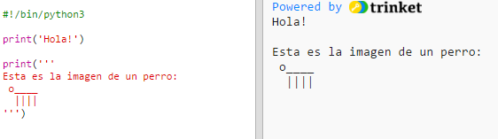

---
title: Acerca de Mi
level: Python 1
language: es
stylesheet: python
embeds: "*.png"
materials: ["recursos_del_proyecto/nuevo/*.*", "recusos_de_voluntarios/acerca_de_mi_terminado/*.*"]
...

#Introducción:  { .intro}

En este proyecto aprenderás como escribir un programa en Python que le diga a las personas acerca de tí.
 

  <iframe src="https://trinket.io/embed/python/d852f1bbc2?outputOnly=true&start=result" width="600" height="500" frameborder="0" marginwidth="0" marginheight="0" allowfullscreen>
  </iframe>
  

#Paso 1: Digamos hola { .activity}

Comencemos escribiendo algo de texto.

## Lista de actividades { .check}

+ Abre una plantilla de Python en blanco en Trinket: <a href="http://jumpto.cc/python-new" target="_blank">jumpto.cc/python-new</a>. Si estás leyendo esto en linea, puedes tambíen usar la versión embebida de este trinket que aparece más abajo.

<iframe src="https://trinket.io/embed/python/33e5c3b81b?start=result" width="100%" height="400" frameborder="0" marginwidth="0" marginheight="0" allowfullscreen></iframe>

+ Escribe lo siguiente en la ventana que aparece:

    

    La línea `#!/bin/python3` simplemente le dice a Trinket que estamos usando Python 3 (la última versión).

+ Presiona 'run', y deberías ver que la instrucción `print()` imprime todo lo que se encuentra entre las comillas `''`.

    

+ Si cometes un error, aparecerá un mensaje de error indicando qué salió mal! 

    Pruébalo. Elimina la comilla final `'` o el paréntesis de cierre `)` (o ambos) y observa qué sucede.

    

+ Vuelve a colocar la comilla o el paréntesis y presiona 'run' para asegurarte de que tu programa funciona bien.

## Guarda tu proyecto {.save}

__No necesitas una cuenta en Trinket para grabar tus proyectos!__ 

Si no tienes una cuenta en Trinket, haz click en la flecha hacia abajo y luego click en 'Link'. Esto te dará un enlace que puedes guardar y abrir más tarde. Necesitarás hacer esto cada vez que hagas cambios, ya que el enlace cambiará!

Si tienes una cuenta en Trinket, puedes hacer click en 'remix' para guardar tu propia copia del programa en Trinket.

## Desafío: ¿Qué estás pensando? { .challenge}
Cambia el código que se muestra a continuación, para que imprima algo más interesante acerca de ti!

## Guarda tu proyecto {.save}

#Paso 2: Arte ASCII { .activity}

Vamos a imprimir algo mucho más divertido que texto… arte ASCII! (se pronuncia '_aski_') y consiste en crear __ imágenes usando texto__.

## Lista de actividades { .check}

+ Vamos a añadir algo de arte a tu programa - la imagen de un perro!

    

+ Si prefieres, puedes usar tres comillas simpes `'''` en lugar de una, lo que te permite imprimir múltiples líneas de texto con una sola instrucción `print`:

    

## Guarda tu proyecto {.save}

## Desafío: Acerca de ti { .challenge}
Escribe un programa en Python para contarle a otros acerca de ti, usando texto y arte ASCII. Puedes crear imágenes de tus pasatiempos, amigos… o cualquier cosa que te guste!

__Recuerda que el código que escribes en Trinket es público. No compartas ninguna información personal como tu nombre completo o dirección!__

Aquí tienes un ejemplo:

## Guarda tu proyecto {.save}

#Paso 3: El año 2025 { .activity}

También puedes realizar cálculos e imprimir números. Veamos qué edad tendrás en el año 2025.

## Lista de actividades { .check}

+ Para calcular qué edad tendrás en el año 2025, necesitas restar el año en que naciste de 2025.

    Añade éste código a tu programa:

    

    Fíjate que no necesitas colocar los números entre paréntesis.

    (Tienes que cambiar el número `2006` por el año en que naciste.)

+ Haz click en 'run' y tu programa debería imprimir tu edad en el año 2025.

    

+ Puedes mejorar tu programa usando la instrucción `input()` para pedirle al usuario que escriba su año de nacimiento y guardarlo en una __variable__ llamada `nacimiento`.

    

+ Haz correr tu programa e introduce el año en que naciste. ¿Otra vez apareció un mensaje de error?

    Eso se debe a que cualquier cosa que ingreses en tu programa es __texto__, y en este caso necesita ser convertido en un  __número__.

    Puedes usar `int()` para convertir el texto en un __entero__ ('entero' significa 'número completo').

    

+ También puedes carear otra variable para guardar tus cálculos, e imprimirla.

    

+ Finalmente, puedes hacer que tu programa sea más fácil de entender añadiendo un mensaje amable.

    

## Guarda tu proyecto {.save}

## Desafío: Tu edad en años de perro { .challenge}
Escribe un programa que pregunte al usuario su edad, y luego le diga su edad en años de perro! Puedes calcular la edad de una persona en años de perro multiplicando su edad por siete.

En programación, el símbolo para la __multiplicación__ es `*`, y usualmente es __shift+8__ en el teclado.

## Guarda tu proyecto {.save}

## Desafío: Calculanto texto { .challenge}
¿Sabías que también puedes calcular texto?

¿Qué es lo que el programa siguiente imprime en la pantalla? Trata de adivinar correctamente antes de correr el programa.

¿Puedes inventar algunas palabras por tu cuenta? Puedes incluso construir tus propios patrones.

## Guarda tu proyecto {.save}

